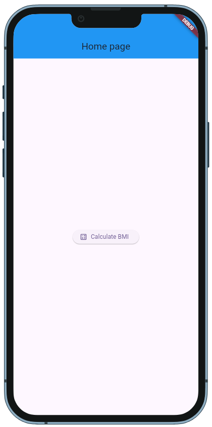
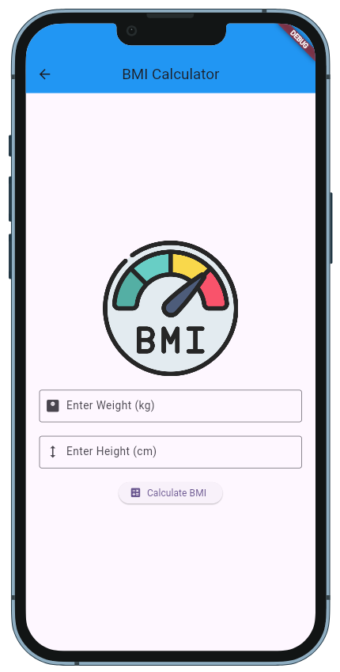
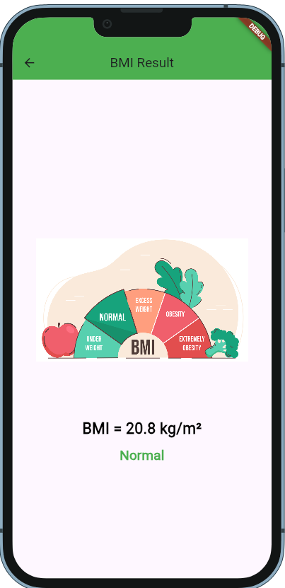

<!-- web build command: flutter build web --base-href /bmi_app/ --release -->

# BMI Calculator

A simple Body Mass Index (BMI) Calculator app built using Flutter.

## 📱 Features
- Input weight (kg) and height (cm)
- Calculate BMI instantly
- Categorize BMI into different ranges
- Smooth navigation using GetX
- Responsive UI with Device Preview

## 🛠️ Technologies Used
- Flutter
- Dart
- GetX (State Management & Navigation)
- Device Preview (For testing UI on multiple devices)

## 📸 Screenshots

| Home Page | BMI Input | Result |
|-----------|----------|--------|
|  |  |  |


## 👉 Live Demo


## 🚀 Getting Started

### Prerequisites
- Install [Flutter](https://flutter.dev/docs/get-started/install)
- Install Dart SDK
- Set up a suitable IDE (VS Code, Android Studio, etc.)


## 📂 Project Structure
```
/lib
├── main.dart           # Entry point
├── homepage.dart       # Home page with navigation
├── bmi_screen.dart     # BMI input screen
├── result.dart         # BMI result screen
├── assets/images/      # Images used in UI
└── pubspec.yaml        # Dependencies and assets
```

## 🔥 How It Works
1. User enters weight and height.
2. Clicks the "Calculate BMI" button.
3. Navigates to the result screen displaying BMI value and category.


## 🌟 Show Your Support
If you like this project, give it a ⭐ on [GitHub](https://github.com/yourusername/bmi_calculator)! 🎉


## 👤 Author

**Md. Shoaib**  
📧 Email: shoaibcsecu@gmail.com  
🔗 GitHub: [Md. Shoaib](https://github.com/S-h-o-a-i-b)